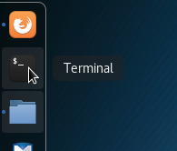

# Intro
OK. Welcome to our RvB environment. We're going to need to connect to a VPN first. 

## VPN setup
- You'll need to setup pritunl. If you're not on one of our Kali boxes, you can install it [here](https://client.pritunl.com/#install). If you are on our Kali boxes, it's already installed. It'll be in the bottom left corner.

- Go ahead and right click on the icon and hit `Import profile URI`.
- Enter in the URI that is written on the whiteboard.
- Then right click the icon again, select kali@UVUCSC (CCDC) and hit connect.
- It'll ask you for a pin: `4895126` (Can you guess the pattern?)
- Ask Mike Weaver for the 2fa code, and it should connect.
- Open a Terminal.

- Now `ping -c 1 10.0.0.1`, then `ping -c 1 google.com`. If those comeback successful then you're all good. If you're not good, talk to someone for help.

## Network

The network you're attacking is `10.0.0.1/24`. 
There are 2 IPs which are out of scope (don't touch them!)
- `10.0.0.1` - The Firewall/DHCP/DNS server
- `10.0.0.2` - The Pritunl VPN server

This means you can attack any machine between `10.0.0.3` to `10.0.0.255`. Don't DDOS anything, as the whole VM infrastructure is on one PC and we don't want to break it. Other than that, there are no rules. If you get into a box and want to cause mayhem, by all means do it. Ever wondered what would happen with `rm -rf /`? Now's a good time to try. :)

Here's a list of all the machines:
- 9 Linux Servers
- 4 Windows Servers
- 3 Windows XP Machines

Ok. You're free. Have fun!

## Tutorials

Now, maybe you want some guidance? We've got some tutorials for you:
- [Map the Network](nmap.md)
