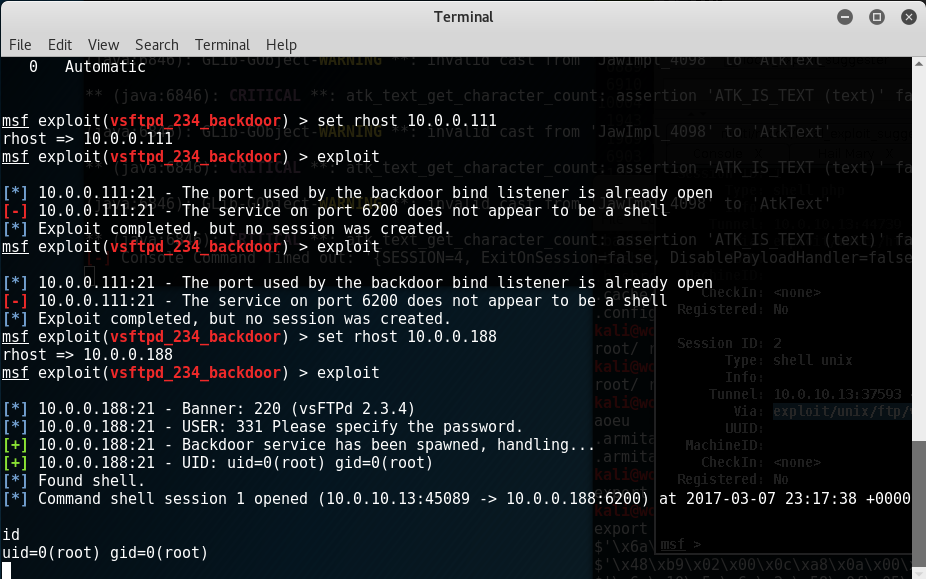
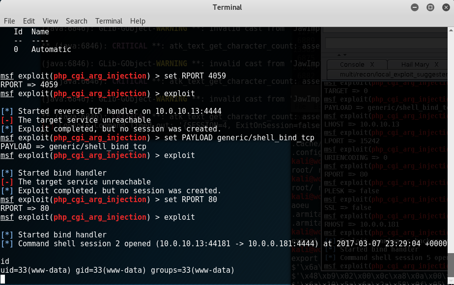
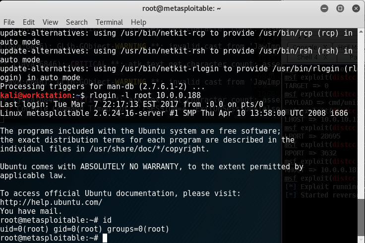
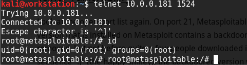

# Example Exploit 
There are multiple exploits for this Metasploitable2 box. Here is some information how how to do some of them.

If you haven't gone and done the [Windows XP](windowsxp.md) tutorial and you don't know how to use metasploit, go over there and test it out.

## exploit/unix/ftp/vsftpd_234_backdoor
Go ahead and use metasploit for this attack. Follow the same principles as before. 

This is an interesting one. [vsftpd backdoor](http://scarybeastsecurity.blogspot.com/2011/07/alert-vsftpd-download-backdoored.html)



I'm not sure which hosts are vulnerable. Hopefully they don't patch it quick. 

## multi/http/php_cgi_arg_injection
Go ahead and use metasploit for this attack too. Follow the same principles as before. 

Set your payload to `set PAYLOAD generic/shell_bind_tcp`

This is a PHP exploit. You won't get root with this. 

[PHP CGI](http://eindbazen.net/2012/05/php-cgi-advisory-cve-2012-1823/)



I don't think they'll patch this one very quick.

## rlogin/telnet backdoor

This one is pretty simple. There's a backdoor in [rlogin and telnet](http://www.kalitutorials.net/2014/05/metasploitable-2-vulnerability.html)

```
sudo apt update; sudo apt install rsh-client
rlogin -l root 10.0.0.188
```



`telnet 10.0.0.188 1524`



Hurry quick on this one.


