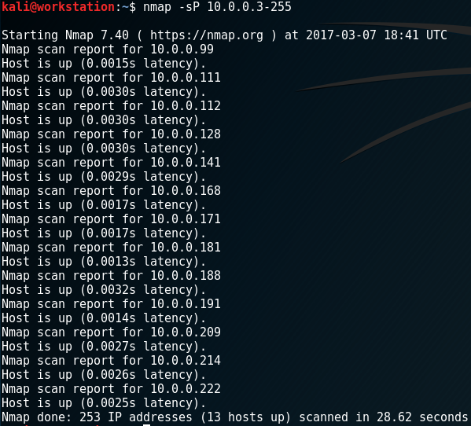
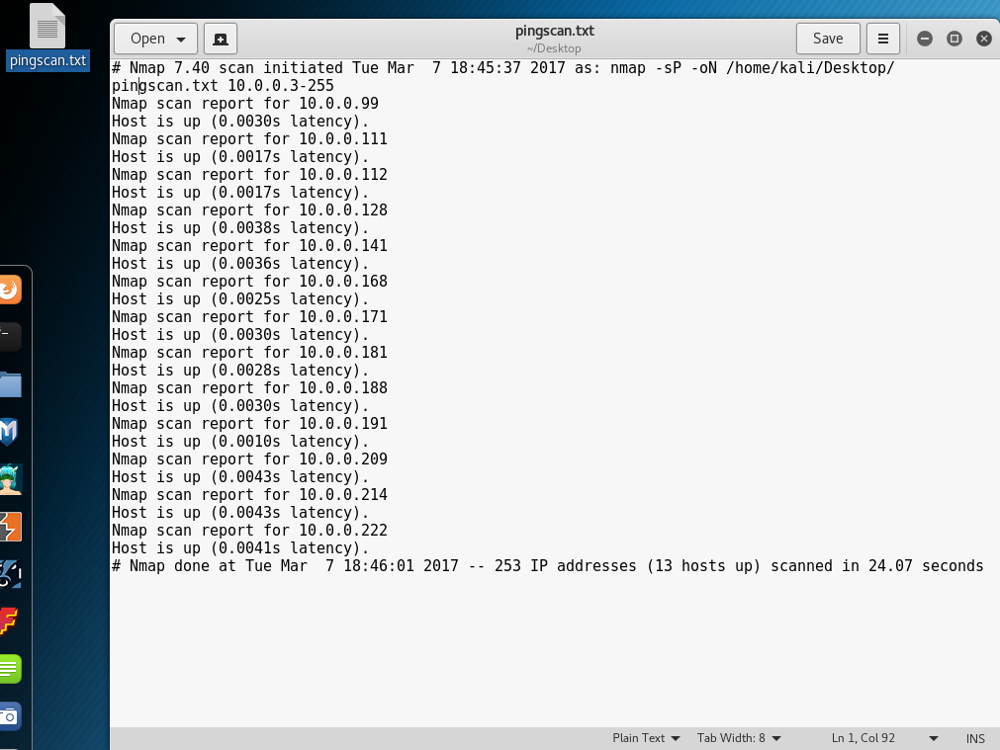
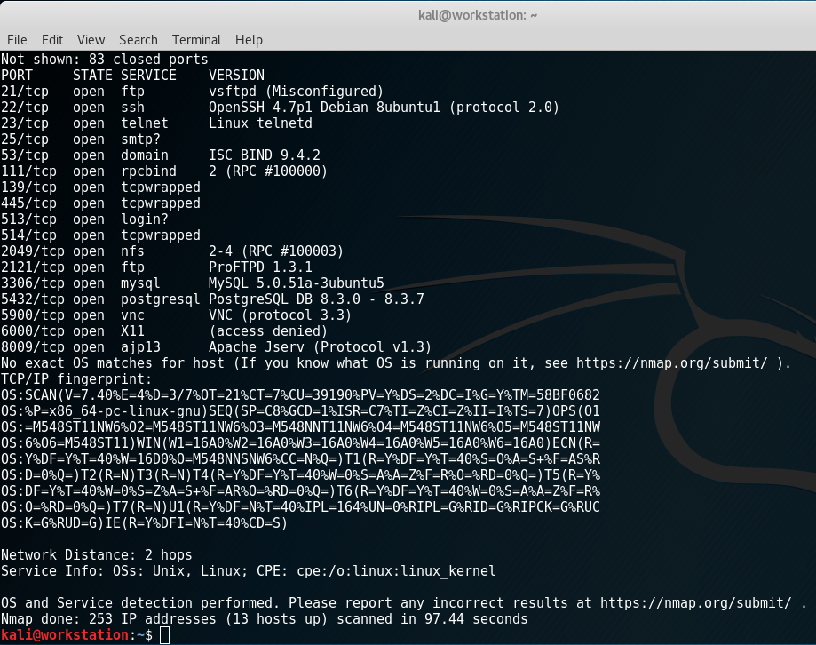
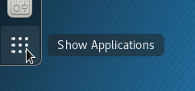

# Nmap Tutorial
Ok, so I can't give you a full blown tutorial on Nmap. This would take forever. What I'll do instead is give you enough instructions to map the entire network we're working on, and the provide some "additional reading" you can use at the end.

## Step 1 - Quick Scan
Ok, we're going to run a really quick scan. 

`nmap -sP 10.0.0.3-255`

This is called a ping scan (`-sP`). Basically it checks every host that responds to ICMP pings. Yours should look like this:

As you can see we get 13 hosts up.
Let's save that result to a file.

`nmap -sP 10.0.0.3-255 -oN ~/Desktop/pingscan.txt`

That'll take a second to run, when it's done it'll write a file to your desktop that looks like the scan we got back.

## Step 2 - OS Detect
Alright, we've got 13 hosts saved to a file now. That's great, but which ones are the windows or linux machines? That's where [OS Detect](https://nmap.org/book/man-os-detection.html) comes in. 

Here's the command. You'll need sudo for `-O` (OS Detect). `-sV` Probes the open ports to determine service/version info. This helps considerably to determine the version. `-F` and `--version-light` all help make it run a lot faster.

`sudo nmap -sV -T4 -O -F --version-light 10.0.0.3-255`

Perfect! We've now got a list of the machines and their OS Type.

## Step 3 - Zenmap

OK. This is great. We've got 13 hosts with OS Types. It's been kind of hard to keep track of them though. We created that text file earlier, but text isn't the prettiest to work with. That's where ZenMap comes in. It's a GUI for nmap.

Open up your applications:

Select `Zenmap (as root)`.

Let's re-create our ping scan with Zenmap.
- Enter `10.0.0.3-255` in the `Targets`
- Under `Profile` select `Ping Scan`
- In the `Command` section, make sure it matches our previous ping scan command.
- Hit the `Scan` Button.
