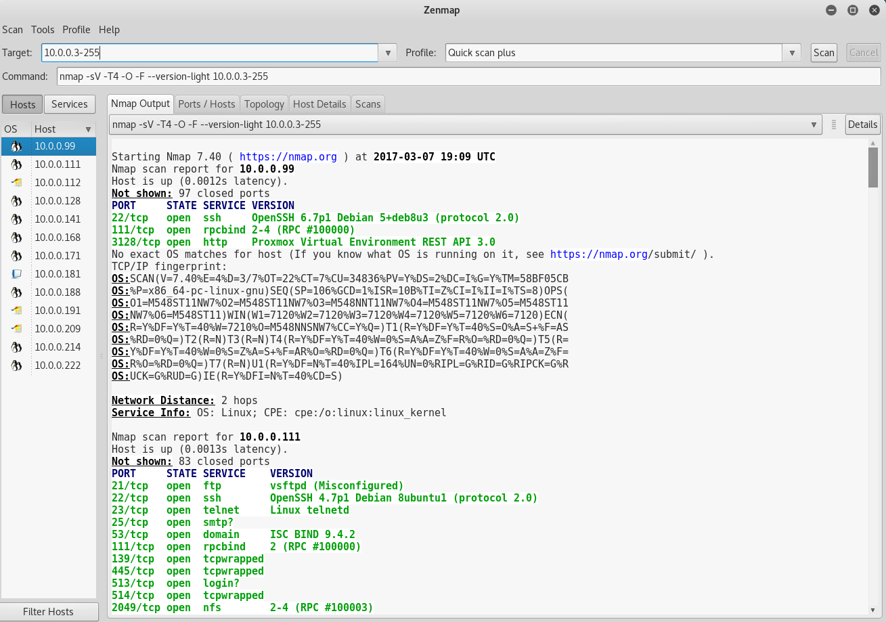

# Nmap Tutorial
Ok, so I can't give you a full blown tutorial on Nmap. This would take forever. What I'll do instead is give you enough instructions to map the entire network we're working on, and the provide some "additional reading" you can use at the end.

_Note:_ All these screen shots have `10.0.0.3-255`. That is WRONG. Follow the commands in the tutorial. `10.0.0.4-255`.

## Step 1 - Quick Scan
Ok, we're going to run a really quick scan. 

`nmap -sP 10.0.0.4-255`

This is called a ping scan (`-sP`). Basically it checks every host that responds to ICMP pings. Yours should look like this:

As you can see we get 12 hosts up.
Let's save that result to a file.

`nmap -sP 10.0.0.4-255 -oN ~/Desktop/pingscan.txt`

That'll take a second to run, when it's done it'll write a file to your desktop that looks like the scan we got back.

## Step 2 - OS Detect
Alright, we've got 12 hosts saved to a file now. That's great, but which ones are the windows or linux machines? That's where [OS Detect](https://nmap.org/book/man-os-detection.html) comes in. 

Here's the command. You'll need sudo for `-O` (OS Detect). `-sV` Probes the open ports to determine service/version info. This helps considerably to determine the version. `-F` and `--version-light` all help make it run a lot faster.

`sudo nmap -sV -T4 -O -F --version-light 10.0.0.4-255`

Perfect! We've now got a list of the machines and their OS Type.

## Step 3 - Zenmap

OK. This is great. We've got 12 hosts with OS Types. It's been kind of hard to keep track of them though. We created that text file earlier, but text isn't the prettiest to work with. That's where ZenMap comes in. It's a GUI for nmap.

Open up your applications:

Select `Zenmap (as root)`.

Let's re-create our ping scan with Zenmap.
- Enter `10.0.0.4-255` in the `Targets`
- Under `Profile` select `Ping Scan`
- In the `Command` section, make sure it matches our previous ping scan command.
- Hit the `Scan` Button. (Takes about 45 seconds)

You should get the same output in the `Nmap Output` section, but you'll also get a list on the side of all our hosts. Sweet huh?

Let's try the OS Detect scan. 
Let's re-create our ping scan with Zenmap.
- Make sure `10.0.0.4-255` in the `Targets`
- Under `Profile` select `Quick Scan Plus`
- In the `Command` section, make sure it matches our previous os detect scan command.
- Hit the `Scan` Button. (Takes about a minute and a half)

Now you should see all our hosts with their OS Type symbols on the left.

## Step 4 - Missing Machines
In the intro we mentioned there were:
- 9 Linux Servers
- 4 Windows Servers
- 3 Windows XP Machines

That's 16 hosts, and we've only picked up 12? We must be missing the Windows Servers.

Well, the answer lies in the fact that all the commands we've used rely on a ping scan. These hosts must not be responding to ping. Let's try another, slower, command that actually attempts connections, without pinging. We'l want to do a full [syn scan](https://nmap.org/book/man-port-scanning-techniques.html#idp47152075737312) but that'll take a very long time. Since we're really only looking for the windows servers, we can do some tricks to speed the scan up. We know that Windows Servers usually have remote desktop open, so we're going to add `-p 3389` to the command. That will limit the command to port `3389` (remote desktop), and speed our scan up considerably. 

- Make sure `10.0.0.4-255` in the `Targets`
- In the `Command` section, put `nmap -p 3389 -Pn --open 10.0.0.3-255`.
- Hit the `Scan` Button. (Takes about a minute and a half)

This should respond with 4 hosts, our missing Windows Servers!

Now you can go 1 by 1 and scan each of the four with a OS Detect scan. You'll need to add `-Pn` to your scan for it to work.

- Make sure the IP of your new host in the `Targets`
- Under `Profile` select `Quick Scan Plus`
- In the `Command` section, add `-Pn` right after `nmap`.
- Hit the `Scan` Button. 
- Repeat for all 4 hosts.

## Matching

Now you just have to match the IPs to their type. Here's what I found:

#### Windows Server
This is what the Windows Server looks like:

It's [Metasploitable3](https://github.com/rapid7/metasploitable3/wiki). That's probably useful to know. ;-)

#### Linux Server
This is what the Windows Server looks like:

It's [Metasploitable2](https://community.rapid7.com/docs/DOC-1875). That's probably useful too.

#### Windows XP
This is what the Windows Server looks like:

[Windows XP](https://www.exploit-db.com/exploits/16749/)... What a piece of junk.

# Finished

Good work. You've identified all the machines. Now it's time to hack them.
