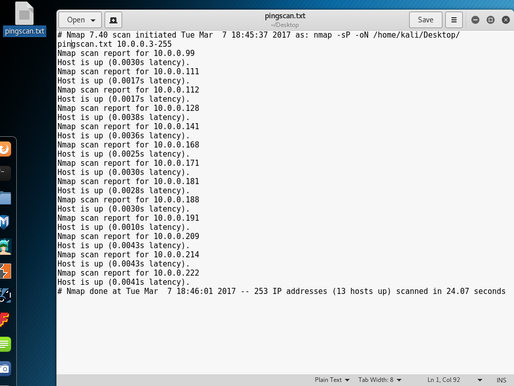

# Example Exploit 
There are multiple exploits for an un-patched windows xp box. Here is a guide on how to do one of them:

## Step 1 - Metasploit
Ok, we're going to run a really quick scan. 

`nmap -sP 10.0.0.3-255`

This is called a ping scan (`-sP`). Basically it checks every host that responds to ICMP pings. Yours should look like this:

As you can see we get 13 hosts up.
Let's save that result to a file.

`nmap -sP 10.0.0.3-255 -oN ~/Desktop/pingscan.txt`

That'll take a second to run, when it's done it'll write a file to your desktop that looks like the scan we got back.

## Step 2 - OS Detect
Alright, we've got 13 hosts saved to a file now. That's great, but which ones are the windows or linux machines? That's where [OS Detect](https://nmap.org/book/man-os-detection.html) comes in. 
